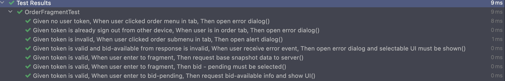
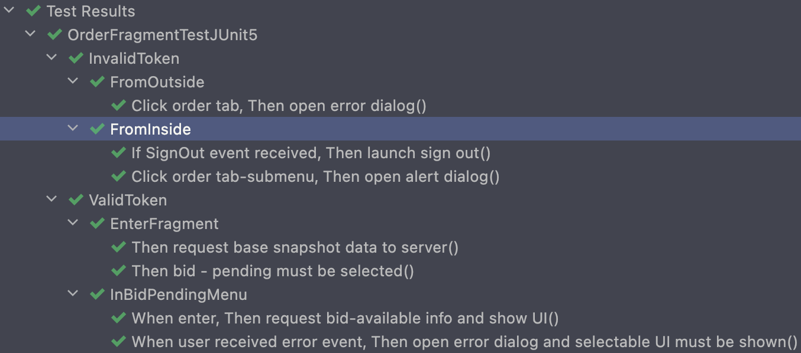

### [Android] Readable UnitTest - JUnit5

안녕하세요, 이번 시간에는 **JUnit5** 와 함께하는 **가독성 좋은 UnitTest** 에 대해서 다뤄볼 생각입니다.

안드로이드 프로젝트는 보통 `JUnit4` 로 작성된 단위테스트(UnitTest)들이 작성되어 있고, 그 수는 앱의 크기에 따라 수백 ~ 수만에 달합니다. 이 경우, 단위테스트의 개수가 많아짐에 따라 가독성의 저하가 심각하게 일어난다는 문제점이 발생합니다. 덤으로 유닛테스트 작성시마다 따라오는 테스트케이스의 네이밍 또한 수없이 고민하게 되고, 기존 테스트케이스 이름을 리팩토링하는 등 사이드이펙트가 발생하게 됩니다.

이러한 문제점을 해결하기 위해  **JUnit5** 를 안드로이드 프로젝트에 도입하기로 했습니다. 기존에 스프링 부트를 활용한 프로젝트에선 이미 마이그레이션 해 작업해본 경험이 있어 수월할 줄 알았는데, 안드로이드에서는 조금의 노력이 더 들어갔습니다. 

이 글을 보는 분들은 저와 같이 검색지옥에 빠지시지 않길 바라며, 쉽게 테스트 가독성을 높이길 바라며 글을 작성합니다.

> 본 글에 수록된 Gradle 설정 및 예제 코드는 `Gradle Kotlin DSL` 과 `kotlin` 으로 작성되어 있습니다.


#### JUnit5 구성

이전 버전인 `JUnit4` 는 단일 jar로 제공되는 유닛 테스트 프레임워크였지만 5 버전은 3 개의 서브 프로젝트 들로 구성되어 있습니다.

**JUnit 5 = *JUnit Platform* + *JUnit Jupiter* + *JUnit Vintage***

**(1) JUnit Platform** 

- JVM 상에서 동작하는 테스트 프레임워크입니다. 또한 플랫폼에서 동작할 테스트 프레임워크를 개발하기 위한 API인 [TestEngine](https://junit.org/junit5/docs/current/api/org.junit.platform.engine/org/junit/platform/engine/TestEngine.html) , [Java CLI](https://junit.org/junit5/docs/current/user-guide/#running-tests-console-launcher) 등 다양한 확장성을 제공합니다.

**(2) JUnit Jupiter**

- 실질적인 JUnit5 를 실행하기 위한 프로젝트입니다. 테스트를 작성하기 위한 프로그래밍 모델들과 Extension 들을 제공합니다.

**(3) JUnit Vintage**

- 5버전으로 변경되면서 테스트 수트의 동작 방식이 변경되었기 때문에 호환성을 위해 제공되는 **JUnit 3, 4** 테스트엔진입니다.

> JUnit5 런타임은 Java8 이상을 요구하지만, 이전 버전의 JDK 로 컴파일된 코드들도 테스트가 '가능' 합니다.

그럼 가장 큰 변화를 알아볼 차례입니다. 왜 우린 갑자기 이렇게 상세해지고, 복잡해진 5 버전을 사용해야할까요? 과연 정말 편리할까요 ?


#### Android - JUnit5 세팅하기

우선 안드로이드 프로젝트(모듈) 이 아닌 **Java/Kotlin Native Module** 에서 실행하기 위해 세팅합니다. **안드로이드 모듈** 에서도 아래까지만 세팅하더라도 일반 단위테스트는 모두 실행가능합니다.

```kotlin
// in build.gradle.kts
// dependency
dependencies {
  // (필수) 테스트를 구동하기 위한 엔진은 런타임시에만 필요하므로 선택적 의존성으로 채택합니다.
  testRuntimeOnly("org.junit.jupiter:junit-jupiter-engine:5.9.1")
  // (필수) JUnit5 기본 API
  testImplementation("org.junit.jupiter:junit-jupiter-api:5.9.1")
  // (선택) JUnit5 ParameterizedTests 관련 API
  testImplementation("org.junit.jupiter:junit-jupiter-params:5.9.1")
  // (선택) JUnit3, 4 로 기작성된 테스트케이스가 존재할 경우
  testImplementation("junit:junit:4.13.2")
  testImplementation("org.junit.vintage:junit-vintage-engine:5.9.1")
}

// 프로젝트 단위의 allprojects 스코프 혹은 각 모듈별 gradle 에 아래 태스크를 추가합니다.
tasks.withType(Test::class) {
  useJUnitPlatform()
  testLogging {
    events.addAll(arrayOf(TestLogEvent.PASSED, TestLogEvent.SKIPPED, TestLogEvent.FAILED))
  }
}
```

안드로이드 스튜디오는 기본적으로 **JUnit4** 를 제공하며 공식적으로 **JUnit5** 를 지원하기 위한 계획이 따로 없기 때문에,  안드로이드 `Instrumental Test` 에도 적용하기 위해서는 아래와 같은 추가작업이 필요합니다.

> [mannodermaus](https://github.com/mannodermaus) 님께서 만들어주신 [플러그인](https://github.com/mannodermaus/android-junit5) 을 이용해 안드로이드 프로젝트에서도 이용 가능하게 되었습니다. 감사합니다 :)

```kotlin
// 안드로이드 Instrumental Test 를 사용할 모듈의 build.gradle.kts 에 플러그인 추가
plugins {
	id("de.mannodermaus.android-junit5") version "1.8.2.1"
}
```

```kotlin
// android 모듈의 build.gradle.kts 에 아래 항목 추가
android {
  defaultConfig {
    testInstrumentationRunner "androidx.test.runner.AndroidJUnitRunner"
    testInstrumentationRunnerArgument "runnerBuilder", "de.mannodermaus.junit5.AndroidJUnit5Builder"
  }
}

dependencies {
  // plugin runtime
  androidTestRuntimeOnly("de.mannodermaus.junit5:android-test-runner:1.3.0")
  // espresso
  androidTestImplementation("androidx.test.espresso:espresso-core:3.5.0")
  // Jupiter API & Ext
  androidTestImplementation("org.junit.jupiter:junit-jupiter-api:5.9.1")
  androidTestImplementation("org.junit.jupiter:junit-jupiter-params:5.9.1")
  // plugin test core
  androidTestImplementation("de.mannodermaus.junit5:android-test-core:1.3.0")
}
```

자, 이제 **Gradle Sync** 를 통해 의존성을 다 추가한 후에 본격적으로 가독성 높은 테스트코드를 작성해보겠습니다.


#### JUnit5 으로 테스트 가독성 높이기

먼저 기존에 안드로이드에서 기본적으로 제공하는 **JUnit4** 를 이용한 테스트케이스를 한번 들여다보겠습니다. 코틀린은 다행히 아래 사진과 같이 공백과 일부 특수문자를 포함하는 문장 형태의 네이밍을 가능하게 해줍니다. 덕분에 보다 편하게 구분 가능한 테스트케이스를 구성해왔습니다. 

하지만 실제 프로젝트에서는 하나의 `testsuite` ( 그룹 ) 에 수백개의 테스트케이스가, 수백 수천개의 테스트수트가 존재할 수 있습니다. 그렇게 되면 하나하나 네이밍하는데에 엄청난 시간이 들어가게 됩니다... *( 지옥 )*


위 테스트케이스를 실행햇을 때, 아래와 같이 결과를 확인할 수 있다. 하지만 정말 이렇게 수없이 많은 테스트케이스를 보고 정확히 테스트들의 목적을 파악할 수 있을까 ? 그걸 피하기 위해 테스트수트를 잘게 쪼갠다면 엄청나게 많은 테스트수트들을 다 파악하기 쉬울까 ?



만약 이러한 상황에서 테스트케이스가 실패한다면 지옥을 맛보게 될 것이다.

> 실제로 **CI** 환경에서 테스트 케이스들이 실패한 채로 발견되면 어떻게 찾지, 그리고 각 테스트케이스가 원하는게 정확히 뭐지.. 머리가 하얘진다. 배포하려고 테스트 도는데 실패하기 시작하면 정말 퇴근하고 싶어집니다.
>


#### 그래서 준비했습니다. `@Nested` 와 `@DisplayName` 

**JUnit5** 에서 제가 제일 환호했던 기능입니다. 각 테스트를 손쉽게 분류하고, 구분할 수 있도록 해주는 두개의 어노테이션을 제공해줍니다.

- @Nested : class 를 Nested Class 로 취급해 테스트케이스를 계층화 시켜줌
- @DisplayName : Test 혹은 Nested Class 에 원하는 네이밍을 주입함

예제와 함께 확인해보겠습니다. `@Nested` 먼저 만나볼까요? 

아래와 같이 계층적으로 클래스구조로 나누고, 테스트케이스들의 네이밍을 확 줄일 수 있습니다. 

> 아래 나눈 구조는 실제 제가 사용하는 스타일이 아닌 글을 위해서 임의로 나눈 것이며, 분류는 각 프로젝트의 컨벤션에 맞춰 작성하시면 됩니다.
>
> `@Nested` 어노테이션은 inner class 에 대해서만 허용됩니다 :) 코틀린 개발자들은 주의하세요!


계층 구조와 함께 **각 테스트가 어떤 범주에 속하는지, 정확히 어떤 케이스에 관한 것인지** 조금 더 알기 쉬워진것 같습니다.



그렇다면 여기에 `@DisplayName` 까지 적용해보겠습니다. *( 뭔가 길어지긴 더 길어졌어.. 어노테이션이 너무 많아요ㅠ )*

> 메소드 명이 엄청 간결해진 것 보이나요 ?
>
> 위에서 일부러 설명을 안했는데, `Nested` 가 지원됨과 함께 각 테스트케이스들은 클래스 단위로 격리되므로 범위가 다르다면 메소드 명도 같은 것을 쓸 수 있어 보다 네이밍에 대한 걱정이 줄어듭니다 ㅎㅎ


실행해보면 아래와 같은 결과를 확인해볼 수 있습니다. 한결 눈이 편해졌습니다 :D

테스트케이스들을 적절하게 그루핑하고 각 그룹에 대한 적절한 네이밍이 더해진다면 아주 훌륭한 테스트 작성이 가능하겠죠 ?


가독성 좋은 테스트코드, **JUnit5** 와 함께 쉽게 작성해보시는 것 어떨까요 ?

다음 시간에는 **ParameterizedTest** 와 같은 효율적인 테스트를 위해 제공되는 유용한 **JUnit5 Test Extension** 을 둘러보겠습니다.

---

#### References

- [JUnit5 유저 가이드](https://junit.org/junit5/docs/current/user-guide/) 